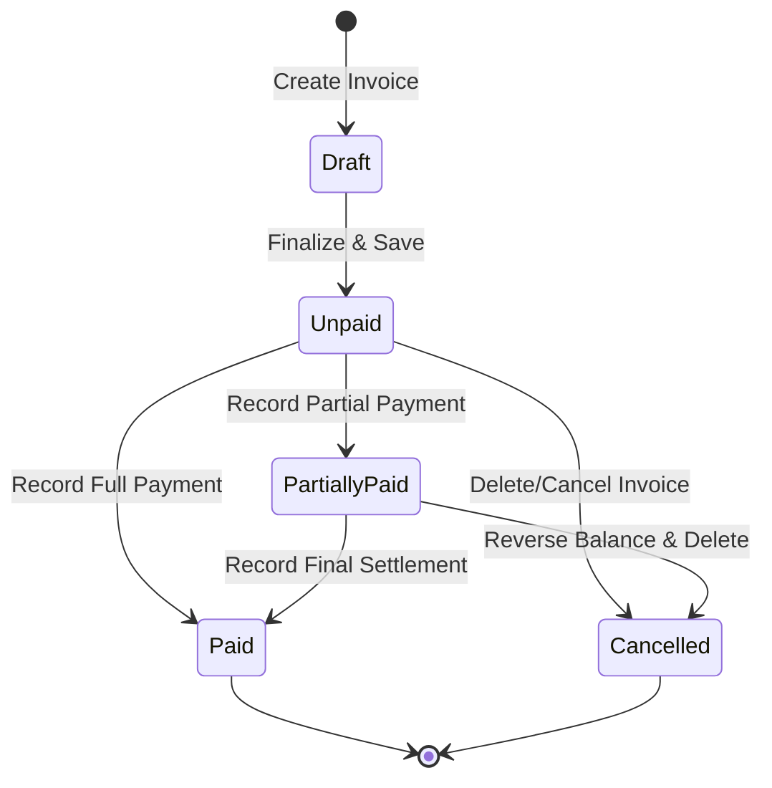
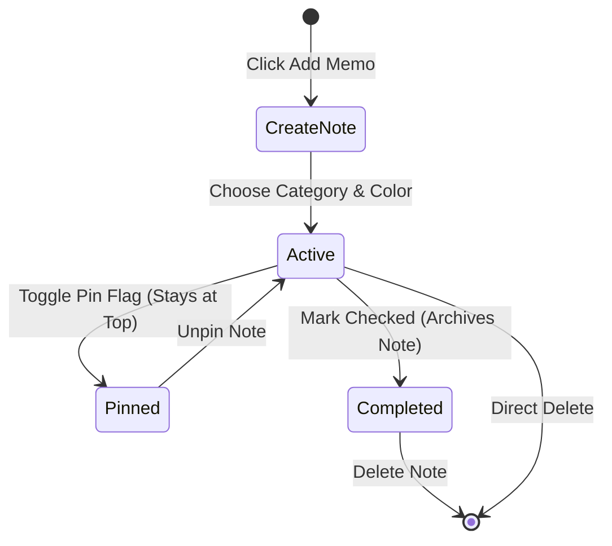

# App Flow Document (AFD)

**Project Name:** VSR Ledger  
**Project Type:** Mobile-first Full Stack Micro ERP & Business Ledger Web Application  
**Version:** 1.0.0  
**Target Audience:** Single Admin (Business Owner / Internal Operator)  
**UX Paradigm:** Frictionless, high-contrast, optimized for single-handed mobile navigation.

---

## 1. Overall Navigation Flow

The VSR Ledger application is designed for speed and ease of use. The navigation architecture ensures the Admin can access any business ledger, register stock catalog updates, or generate high-fidelity tax invoices in under three taps.

```
                         +-----------------------------+
                         |      Unauthenticated        |
                         |        Login Wall           |
                         +-----------------------------+
                                        |
                                        | Admin enters valid credentials
                                        v
                         +-----------------------------+
                         |     Control Dashboard       |
                         +-----------------------------+
                                        |
           +----------------------------+----------------------------+
           |                            |                            |
           v                            v                            v
+---------------------+      +---------------------+      +---------------------+
|    Left Drawer      |      |   Top App Bar       |      | Mobile Bottom Nav   |
| (Responsive Menu)   |      | (Global Utilities)  |      |  (Frictionless)     |
+---------------------+      +---------------------+      +---------------------+
  - Buyers Ledger              - Page Title                 - Dashboard
  - Suppliers Ledger           - Global Search              - Invoices
  - Material Catalog           - Notes Popup                - Buyers
  - Raw Material Stock         - Notifications              - Reports
  - Quotations Sheet                                        - Settings
  - Tax Invoices
  - System Reports
  - Settings Panel
  - Audit Trail Log
```

- **Primary Entry Point:** Unauthenticated traffic is stopped at the **Login Wall**. A valid credentials submission routes the Admin to the **Control Dashboard**.
- **Context Routing:** The application uses three concurrent navigation systems that adapt dynamically to screen sizing constraints:
  1. **Left Drawer Navigation:** Primary panel switcher on desktop and tablet, accessible on mobile via the top-left menu icon.
  2. **Top App Bar:** Holds page titles and instant utility access buttons (Search, Pinned Notes bottom sheet, and Notification Center).
  3. **Mobile Bottom Navigation Bar:** Highly visible, thumb-accessible bar rendering quick-links to the most frequently used modules (**Dashboard**, **Invoices**, **Buyers**, **Reports**, **Settings**).

---

## 2. Screen Hierarchy

The diagram below details the structural hierarchy of every screen and sub-panel inside VSR Ledger:

```
[Root] VSR Ledger App Canvas
 ├── [Page] Login Wall & Forgot Password Dialog
 ├── [Layout] Primary Admin Interface Wrapper
 │    ├── [Navbar] Top Header Bar (☰ Menu, Search, Notes, Notifications)
 │    ├── [Sidebar] Left Navigation Drawer
 │    └── [Bottombar] Touch-optimised Mobile Utility Bar
 ├── [Module] Control Dashboard
 │    ├── [Widget] Financial KPI cards (Sales, Outstanding Dues, Liabilities)
 │    ├── [Widget] Turnover Sales Chart & Category Revenue Share
 │    ├── [Widget] Recent Activity Feed
 │    └── [Widget] Quick Actions Launchpad
 ├── [Module] Buyers Ledger Manager
 │    ├── [View] Buyers List with Search & Balance-color indicators
 │    └── [View] Buyer Profile Details Drawer
 │         ├── [Tab] Demographic Contact Parameters & GST Details
 │         ├── [Tab] Interactive Financial Ledger (Chronological Running Balance)
 │         ├── [Tab] Invoice & Receipt History Logs
 │         └── [Tab] Contract Documents Vault
 ├── [Module] Suppliers Ledger Manager
 │    ├── [View] Supplier Directory with Contact & Balance details
 │    └── [View] Supplier Profile Hub (Outstanding Liability, Purchase history)
 ├── [Module] Material Stock Catalogue
 │    ├── [View] Material Items Inventory Grid & Stock Alerts
 │    └── [View] Item Audit History & Ledger logs
 ├── [Module] Quotation Proposal Manager
 │    ├── [View] Quotation List (Draft, Sent, Converted status cards)
 │    └── [Form] Create/Edit Quotation Form (Dynamic item calculators)
 ├── [Module] Tax Invoice Manager
 │    ├── [View] Invoices List (Unpaid, Paid, Partial balance filters)
 │    ├── [View] Invoice Details View & Printing panel
 │    └── [Form] Create/Edit Invoice Form
 ├── [Module] Systems Report Center
 │    ├── [Report] Sales Turnover, Profit Margins, GST Liabilities, Stock aging
 │    └── [Utility] PDF, Excel, and CSV file exports
 ├── [Module] Global Settings Manager
 └── [Module] Audit Trail Logs Database
```

---

## 3. Core User Journeys

### 3.1. Authentication & Boot Flow
1. **Boot:** The application initializes. A verification hook queries `localStorage` and Supabase Auth session states.
2. **Redirect:** If no valid session token exists, the interface instantly clears interior states and mounts the **Login Screen**.
3. **Login:** Admin provides credentials. On success, the dashboard transitions into view with a slide-in success Toast.
4. **Forgot Password:** Admin clicks "Forgot Password" on the login wall, launches a secure email recovery form, and on submission receives a verification link.

### 3.2. Creating a Buyer & Managing Profiles
1. Admin navigates to the **Buyers Ledger** screen.
2. Clicks the floating **"+ New Buyer"** button.
3. Complete contact details, company name, and GSTIN.
4. On submission, the system validates inputs, writes to Supabase, logs a success message, and shows the newly added profile card.
5. Tap on the buyer card to open the **Buyer Profile Hub** with transaction histories, contract attachments, and chronological running ledgers.

### 3.3. Managing Materials and Inventory Stocks
1. Admin opens **Material Catalogue**.
2. Tap **"+ Register Material"** to define Name, UoM (e.g., Tons, Bags), safety thresholds, and default purchase/sales pricing parameters.
3. To adjust stock levels, click **"Adjust Stock"** on any material item.
4. Select the adjustment type (`Add`, `Remove`, or `Reconcile`), enter the amount and a short description (e.g., "Supplier delivery intake"), and submit.
5. The system saves the adjustment log, updates the available stock count, and updates visual alert badges if stocks drop below the threshold limit.

### 3.4. Generating Quotations and Converting to Invoices
1. Navigates to **Quotations Sheet** and taps **"Create Quote"**.
2. Selects a Buyer (pre-filling billing details) and adds lines of items from the Material Catalog.
3. The form auto-calculates taxes and subtotal values in real time.
4. Tap **"Save Quotation"**. Once approved by the client, click **"Convert to Invoice"** on the quote card.
5. The system duplicates the quote parameters, creates an official **Invoice**, marks the quote status as *Converted*, decrements raw material inventory quantities, and increases the buyer's outstanding accounts receivable balance.

### 3.5. File Uploads and Invoice Attachments
1. Inside **Invoice Details**, scroll to the **"Invoice Attachments"** widget.
2. Click **"Upload Attachment"** or drag-and-drop a file (e.g., JPEG, PDF).
3. The system validates the file size and type, uploads the file to the private Supabase storage bucket, and adds the record with a secure path to the `invoice_attachments` table.
4. The attachment list updates. Admin can click the item card to fetch a temporary secure URL for instant viewing or download.

---

## 4. Comprehensive CRUD Flows

```
[Trigger Action] -> [Validation Rules Check] -> [Database Query] -> [Log System Activity] -> [UI Notification Toast]
```

To guarantee high system auditability, the CRUD operations follow strict procedures:

### 4.1. Create Operations
- **Logic:** Validate fields -> Verify unique identifiers (e.g., GSTIN, invoice numbers) -> Insert to database -> Append activity log -> Trigger success Toast -> Dismiss modal/form.

### 4.2. Read Operations
- **Logic:** Run query with exact page limits -> Fetch linked entity profiles (e.g., fetching buyer names alongside invoices) -> Render dynamic lists -> Hide skeleton loaders.

### 4.3. Update Operations
- **Logic:** Fetch existing parameters -> Match user edits -> Validate field boundaries -> Update database record -> Append activity log -> Refresh active context -> Display updated metrics.

### 4.4. Delete Operations
- **Logic:** Evaluate cascade constraints (e.g., ensure no unpaid invoices are associated with a buyer to be deleted) -> Present dual-action confirmation modal -> Perform deletion -> Update system state logs -> Present success alert.

---

## 5. UI & UX Navigation Rules

### 5.1. Drawer Navigation
- **Behavior:** Slices smoothly from the left side. On desktop/tablet, it remains pinned. On mobile, it acts as an overlay that can be dismissed by tapping the backdrop or sliding back.

### 5.2. Bottom Navigation
- **Behavior:** Fixed to the bottom on screens smaller than `md` (768px). Includes high-contrast active icons for clear navigation indicators.

### 5.3. Popups & Bottom Sheets
- **Mobile Paradigm:** Popups and quick utilities (e.g., Notes Widget) transition from the bottom edge as a sliding **Bottom Sheet**, optimizing layout for one-handed operation.
- **Desktop Paradigm:** These elements appear as centered, focused overlay modals.

---

## 6. Empty States

Empty states are designed to guide the user on their next action, replacing boring blank spaces with clear guidance:

```
+-----------------------------------------------------+
|                                                     |
|                  ( Elegant SVG Icon )               |
|                                                     |
|                  No Invoices Registered             |
|          Start recording transactions and sales     |
|          to track your business.                    |
|                                                     |
|                 [ + Create First Invoice ]          |
|                                                     |
+-----------------------------------------------------+
```

- **Visual Elements:** Includes a soft, stylized vector icon representing the empty state (e.g., a file icon for invoices).
- **Descriptive Guidance:** A short, encouraging title and explanation detailing the purpose of the empty module.
- **Action Button:** A high-contrast call-to-action button (e.g., "+ Create First Invoice") to guide the Admin on what to do next.

---

## 7. Search Flow

Global Search is accessible from the top app bar across all modules:

```
[Admin Types query] --(Debounce 300ms)--> [Database Query] --> [Render categorized lists]
                                                                  ├─ Buyers matches
                                                                  ├─ Invoice matches
                                                                  └─ Supplier matches
```

1. **Typing:** The Admin inputs search parameters (names, invoice IDs, GST numbers, phone contacts).
2. **Dynamic Filtering:** The search engine triggers a query with a 300ms debounce to prevent redundant API calls.
3. **Categorized Results:** Search results are grouped and displayed inside a drop-down layout (e.g., "Found 2 Buyers, 3 Invoices"). Selecting an item routes the user directly to that profile/detail view.

---

## 8. Invoice WhatsApp Integration Flow

```
[Invoice Saved] -> [Click WhatsApp Share] -> [Fetch API Payload] -> [Compose text link] -> [Launch URL]
```

1. Admin clicks **"Share on WhatsApp"** inside Invoice Details.
2. The application reads the invoice details, contact parameters, and business settings.
3. Formats and encodes the message payload:
   - Includes greeting, invoice ID, outstanding balance, due date, and a payment page URL.
4. Generates the deep link URL and launches it:
   - On mobile, it opens the WhatsApp native app directly.
   - On desktop, it opens WhatsApp Web in a new browser tab.

---

## 9. Flow Diagrams (Mermaid Syntax)

### 9.1. Invoice Lifecycle Flow


### 9.2. Pinned Memo Notes Flow


---

## 10. Mobile and Desktop Layout Adaptability

### 10.1. Mobile Layout Adaptability (Viewport: < 768px)
- **Primary Input Elements:** Form labels and inputs are stacked vertically with a minimum height of 44px to ensure tap-friendliness.
- **Lists and Tables:** Dense tabular columns are hidden on mobile. Instead, items are rendered as simple card structures to maximize legibility.

### 10.2. Desktop Layout Adaptability (Viewport: >= 1024px)
- **Layout Expansion:** Utilizes a multi-column layout with a pinned sidebar navigation on the left, a detailed list table in the center, and a quick-action drawer on the right.
- **Optimizations:** Supports standard physical keyboard shortcuts (e.g., `Esc` to close modals, `/` to focus search) and interactive cursor hover states on all tables and buttons.
