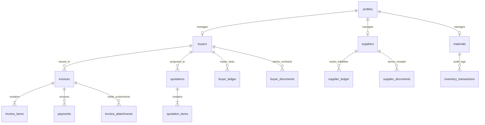

# VSR Ledger — Backend Schema Document (BSD)

**Project Name:** VSR Ledger  
**Project Type:** Mobile-first Full Stack Business Ledger & Micro ERP  
**Backend Platform:** Supabase (PostgreSQL 15+, Auth, and S3 Storage Buckets)  
**Security Architecture:** Private Single-Admin Row-Level Security (RLS)  

---

## 1. Database Overview

The VSR Ledger database layer is built using **PostgreSQL 15+** to guarantee transactional consistency, durability, and rich query support. This system operates on a single-administrator design pattern; there are no complex customer, vendor, or multi-tenant roles. 

### 1.1. Normalization Strategy
The schema is normalized to **Third Normal Form (3NF)** to protect transactional and accounting data integrity:
- **Core Entities:** Master catalogs (Buyers, Suppliers, Materials, Business Settings) are isolated from chronological ledgers and transaction logs.
- **Relational Integrity:** All financial movements (Invoices, Payments, Stock Adjustments, Ledger entries) utilize hard foreign keys to enforce mathematical reconciliations. No unreferenced or dangling logs are permitted.

### 1.2. Strict Naming Conventions
- **Tables and Columns:** `snake_case` using plural forms for tables (e.g., `buyers`, `invoices`, `materials`) and descriptive singular terms for columns (e.g., `invoice_number`, `outstanding_balance`).
- **Primary Keys:** Every table strictly uses a non-serial `UUID` as its primary key, auto-generated using the PostgreSQL `gen_random_uuid()` generator.
- **Foreign Keys:** Prefixed with the target singular table name, followed by `_id` (e.g., `buyer_id` referencing `buyers.id`).
- **Indexes:** Prefixed with `idx_` followed by the table name and target columns (e.g., `idx_invoices_buyer_id`).
- **Triggers:** Prefixed with `trig_` followed by action and target (e.g., `trig_update_stock_on_invoice`).

---

## 2. Entity-Relationship Diagram (ERD)

Below is the visual relationship schema detailing cardinality and connection channels:



---

## 3. Complete Table List & Schema Definitions

All monetary values are stored in `DECIMAL(15,2)` (supporting sums up to ₹9,99,99,99,99,999.99), and inventory weights are tracked in `DECIMAL(12,3)` (supporting three-decimal milligram accuracy for units like tons, kilograms, or liters).

### 3.1. Table: `profiles` (Business Settings)
Stores company profile metadata, bank parameters, and tax metrics.

| Column | Data Type | Nullable | Constraints | Default | Purpose |
| :--- | :--- | :--- | :--- | :--- | :--- |
| `id` | `UUID` | No | PK, FK -> `auth.users.id` | - | Primary identifier matching the admin user auth block. |
| `company_name` | `VARCHAR(255)` | No | - | - | Legal business name printed on tax documents. |
| `address` | `TEXT` | No | - | - | Corporate dispatch and manufacturing address. |
| `phone` | `VARCHAR(20)` | No | - | - | Corporate customer care or desk phone coordinate. |
| `email` | `VARCHAR(255)` | No | - | - | Billing and notifications email interface. |
| `gstin` | `VARCHAR(15)` | No | CHECK (length = 15) | - | Indian GST registration number. |
| `bank_name` | `VARCHAR(100)` | No | - | - | Remittance receiving financial institution. |
| `bank_account` | `VARCHAR(50)` | No | - | - | Bank account number. |
| `bank_ifsc` | `VARCHAR(11)` | No | CHECK (length = 11) | - | IFSC transfer clearance routing parameter. |
| `upi_id` | `VARCHAR(100)` | Yes | - | NULL | Unified Payments Interface payment address (VPA). |
| `qr_code_url` | `TEXT` | Yes | - | NULL | Storage key link to pre-generated static payment QR code. |
| `company_logo_url``| `TEXT` | Yes | - | NULL | Storage key link to business banner or invoice header logo. |
| `invoice_footer` | `TEXT` | Yes | - | NULL | Slogan or greeting rendered at the foot of sales receipts. |
| `terms_conditions` | `TEXT` | Yes | - | NULL | Fine-print legal agreements for invoicing. |
| `currency` | `VARCHAR(5)` | No | - | '₹' | Active monetary symbol used across calculation panels. |
| `default_gst_rate` | `DECIMAL(5,2)`| No | CHECK (>= 0) | 18.00 | Default percentage GST tax calculated on inventory sales. |
| `updated_at` | `TIMESTAMPTZ` | No | - | now() | Timestamp of profile configuration modification. |

*SQL DDL script snippet for indexing profiles:*
```sql
CREATE INDEX idx_profiles_id ON public.profiles(id);
```

---

### 3.2. Table: `buyers`
Tracks client accounts and outstanding financial balances.

| Column | Data Type | Nullable | Constraints | Default | Purpose |
| :--- | :--- | :--- | :--- | :--- | :--- |
| `id` | `UUID` | No | PK | gen_random_uuid() | Unique identifier for the client buyer. |
| `name` | `VARCHAR(255)` | No | UNIQUE | - | Registered business name or buyer company. |
| `contact_person`| `VARCHAR(255)` | Yes | - | NULL | Point-of-contact staff name. |
| `phone` | `VARCHAR(20)` | Yes | - | NULL | Mobile contact number for WhatsApp invoice sharing. |
| `email` | `VARCHAR(255)` | Yes | - | NULL | Email coordinate. |
| `address` | `TEXT` | Yes | - | NULL | Bill-To physical shipping address. |
| `gstin` | `VARCHAR(15)` | Yes | CHECK (length = 15) | NULL | Buyer tax number. |
| `balance` | `DECIMAL(15,2)`| No | - | 0.00 | Running total of outstanding accounts receivables. |
| `is_active` | `BOOLEAN` | No | - | TRUE | Soft-disable boolean to toggle buyer display without purging data. |
| `created_at` | `TIMESTAMPTZ` | No | - | now() | Date when buyer profile was registered. |

```sql
CREATE INDEX idx_buyers_balance ON public.buyers(balance DESC);
```

---

### 3.3. Table: `suppliers`
Tracks material vendors and outstanding manufacturing liabilities (accounts payable).

| Column | Data Type | Nullable | Constraints | Default | Purpose |
| :--- | :--- | :--- | :--- | :--- | :--- |
| `id` | `UUID` | No | PK | gen_random_uuid() | Supplier record key. |
| `name` | `VARCHAR(255)` | No | UNIQUE | - | Vendor business identifier. |
| `contact_person`| `VARCHAR(255)` | Yes | - | NULL | Point-of-contact staff name. |
| `phone` | `VARCHAR(20)` | Yes | - | NULL | Phone number. |
| `email` | `VARCHAR(255)` | Yes | - | NULL | Email coordinate. |
| `address` | `TEXT` | Yes | - | NULL | Warehouse or manufacturing dispatch site. |
| `gstin` | `VARCHAR(15)` | Yes | CHECK (length = 15) | NULL | Vendor Indian GST registration parameter. |
| `outstanding_payable` | `DECIMAL(15,2)`| No | - | 0.00 | Our running total liability owed to the vendor. |
| `is_active` | `BOOLEAN` | No | - | TRUE | Toggle to filter vendors. |
| `created_at` | `TIMESTAMPTZ` | No | - | now() | Vendor onboarding date. |

---

### 3.4. Table: `materials` (Material Catalog)
Central inventory lookup listing specifications, units, and stock quantities.

| Column | Data Type | Nullable | Constraints | Default | Purpose |
| :--- | :--- | :--- | :--- | :--- | :--- |
| `id` | `UUID` | No | PK | gen_random_uuid() | Catalog SKU code reference. |
| `name` | `VARCHAR(255)` | No | UNIQUE | - | Name of raw material. |
| `category` | `VARCHAR(100)` | No | - | 'General' | Tag grouping (e.g., Chemicals, Plastics, Packaging). |
| `uom` | `VARCHAR(20)` | No | - | 'Kgs' | Unit of Measure (e.g., Tons, Bags, Liters, Meters). |
| `default_purchase_rate` | `DECIMAL(15,2)`| No | CHECK (>= 0) | 0.00 | Pre-negotiated intake cost per item unit. |
| `default_sales_rate` | `DECIMAL(15,2)`| No | CHECK (>= 0) | 0.00 | Preset sales rate applied on customer quotation fields. |
| `current_stock` | `DECIMAL(12,3)`| No | - | 0.000 | Dynamic count of physical material available in stock. |
| `minimum_threshold`| `DECIMAL(12,3)`| Yes | CHECK (>= 0) | NULL | Safety trigger count. Triggers dashboard alerts if stock falls below this. |
| `created_at` | `TIMESTAMPTZ` | No | - | now() | Date registered in catalog. |

```sql
CREATE INDEX idx_materials_stock_alert ON public.materials(current_stock, minimum_threshold);
```

---

### 3.5. Table: `inventory_transactions` (Raw Material Inventory Ledger)
Audit trail mapping every stock change (increases from supplier receipts, decreases from invoice dispatches).

| Column | Data Type | Nullable | Constraints | Default | Purpose |
| :--- | :--- | :--- | :--- | :--- | :--- |
| `id` | `UUID` | No | PK | gen_random_uuid() | Log transaction identifier. |
| `material_id` | `UUID` | No | FK -> `materials.id` ON DELETE CASCADE | - | Target material catalog link. |
| `date` | `DATE` | No | - | CURRENT_DATE | Date stock adjustment occurred. |
| `type` | `VARCHAR(20)` | No | CHECK (type IN ('add', 'remove', 'reconcile')) | - | Movement direction tracker. |
| `quantity` | `DECIMAL(12,3)`| No | CHECK (quantity > 0) | - | Mass/count value of items moved. |
| `description` | `TEXT` | Yes | - | NULL | Justification context (e.g., "PO-991 Intake", "Damaged"). |
| `created_at` | `TIMESTAMPTZ` | No | - | now() | Audit timestamp. |

---

### 3.6. Table: `quotations`
Client proposals containing item structures.

| Column | Data Type | Nullable | Constraints | Default | Purpose |
| :--- | :--- | :--- | :--- | :--- | :--- |
| `id` | `UUID` | No | PK | gen_random_uuid() | Quote lookup ID. |
| `quote_number` | `VARCHAR(100)` | No | UNIQUE | - | System alphanumeric code (e.g., Q-2026-0001). |
| `buyer_id` | `UUID` | No | FK -> `buyers.id` ON DELETE RESTRICT | - | Target client buyer profile. |
| `date` | `DATE` | No | - | CURRENT_DATE | Draft issuance date. |
| `due_date` | `DATE` | Yes | - | NULL | Quote pricing expiry date. |
| `subtotal` | `DECIMAL(15,2)`| No | CHECK (subtotal >= 0) | 0.00 | Sum of raw item lines before taxes. |
| `tax_amount` | `DECIMAL(15,2)`| No | CHECK (tax_amount >= 0) | 0.00 | Total calculated GST applied on raw subtotal. |
| `total` | `DECIMAL(15,2)`| No | CHECK (total >= 0) | 0.00 | Absolute commercial invoice totals (Subtotal + Taxes). |
| `status` | `VARCHAR(50)` | No | CHECK (status IN ('Draft', 'Sent', 'Approved', 'Declined', 'Converted')) | 'Draft' | Quote lifecycle status. |
| `notes` | `TEXT` | Yes | - | NULL | Delivery terms or special payment instructions. |
| `created_at` | `TIMESTAMPTZ` | No | - | now() | Date draft was initialized. |

---

### 3.7. Table: `quotation_items`
Detailed lines of items linked directly to quotation sheets.

| Column | Data Type | Nullable | Constraints | Default | Purpose |
| :--- | :--- | :--- | :--- | :--- | :--- |
| `id` | `UUID` | No | PK | gen_random_uuid() | Line item identifier. |
| `quotation_id` | `UUID` | No | FK -> `quotations.id` ON DELETE CASCADE | - | Link to parent quotation proposal sheet. |
| `material_id` | `UUID` | No | FK -> `materials.id` ON DELETE RESTRICT | - | Referenced raw material SKU code. |
| `quantity` | `DECIMAL(12,3)`| No | CHECK (quantity > 0) | - | Total proposed units. |
| `rate` | `DECIMAL(15,2)`| No | CHECK (rate >= 0) | - | Proposed commercial price per unit. |
| `amount` | `DECIMAL(15,2)`| No | CHECK (amount >= 0) | - | Line amount total before tax (`quantity * rate`). |

---

### 3.8. Table: `invoices`
Tax invoice system tracking sales and accounts receivables.

| Column | Data Type | Nullable | Constraints | Default | Purpose |
| :--- | :--- | :--- | :--- | :--- | :--- |
| `id` | `UUID` | No | PK | gen_random_uuid() | Tax Invoice identifier. |
| `invoice_number`| `VARCHAR(100)` | No | UNIQUE | - | Invoice registration code (e.g., INV-2026-0001). |
| `buyer_id` | `UUID` | No | FK -> `buyers.id` ON DELETE RESTRICT | - | Client profile reference. |
| `date` | `DATE` | No | - | CURRENT_DATE | Invoice date. |
| `due_date` | `DATE` | Yes | - | NULL | Payment terms deadline. |
| `subtotal` | `DECIMAL(15,2)`| No | CHECK (subtotal >= 0) | 0.00 | Total invoice value before taxes. |
| `tax_amount` | `DECIMAL(15,2)`| No | CHECK (tax_amount >= 0) | 0.00 | Total calculated GST applied on items. |
| `total` | `DECIMAL(15,2)`| No | CHECK (total >= 0) | 0.00 | Grand Total invoice amount (`subtotal + tax_amount`). |
| `paid_amount` | `DECIMAL(15,2)`| No | CHECK (paid_amount >= 0) | 0.00 | Total amount paid by the customer. |
| `status` | `VARCHAR(50)` | No | CHECK (status IN ('Unpaid', 'Partially Paid', 'Paid')) | 'Unpaid' | Payment completion state tracking. |
| `notes` | `TEXT` | Yes | - | NULL | Internal comments or shipping parameters. |
| `created_at` | `TIMESTAMPTZ` | No | - | now() | Date created. |

```sql
CREATE INDEX idx_invoices_status ON public.invoices(status);
```

---

### 3.9. Table: `invoice_items`
Lines of material items dispatched under a tax invoice.

| Column | Data Type | Nullable | Constraints | Default | Purpose |
| :--- | :--- | :--- | :--- | :--- | :--- |
| `id` | `UUID` | No | PK | gen_random_uuid() | Line item identifier. |
| `invoice_id` | `UUID` | No | FK -> `invoices.id` ON DELETE CASCADE | - | Parent tax invoice sheet reference. |
| `material_id` | `UUID` | No | FK -> `materials.id` ON DELETE RESTRICT | - | Linked catalog SKU. |
| `quantity` | `DECIMAL(12,3)`| No | CHECK (quantity > 0) | - | Volume dispatched. |
| `rate` | `DECIMAL(15,2)`| No | CHECK (rate >= 0) | - | Dispatch price per unit. |
| `tax_rate` | `DECIMAL(5,2)` | No | CHECK (tax_rate >= 0) | 18.00 | Active GST rate applied to this specific item line. |
| `subtotal` | `DECIMAL(15,2)`| No | CHECK (subtotal >= 0) | - | Line amount before tax (`quantity * rate`). |
| `tax_amount` | `DECIMAL(15,2)`| No | CHECK (tax_amount >= 0) | - | Calculated GST tax applied to this line. |
| `total` | `DECIMAL(15,2)`| No | CHECK (total >= 0) | - | Absolute total for this line (`subtotal + tax_amount`). |

---

### 3.10. Table: `payments` (Accounts Receivable Payments)
Tracks payments received from buyers to settle invoice balances.

| Column | Data Type | Nullable | Constraints | Default | Purpose |
| :--- | :--- | :--- | :--- | :--- | :--- |
| `id` | `UUID` | No | PK | gen_random_uuid() | Payment log transaction key. |
| `invoice_id` | `UUID` | No | FK -> `invoices.id` ON DELETE CASCADE | - | Target invoice being settled. |
| `buyer_id` | `UUID` | No | FK -> `buyers.id` ON DELETE CASCADE | - | Linked buyer. |
| `amount` | `DECIMAL(15,2)`| No | CHECK (amount > 0) | - | Sum received in transaction. |
| `payment_method`| `VARCHAR(50)` | No | CHECK (payment_method IN ('Cash', 'Bank Transfer', 'UPI', 'Cheque')) | - | Settlement method. |
| `reference_number`| `VARCHAR(100)`| Yes | - | NULL | Bank transaction code (e.g., IMPS reference, UPI reference, Cheque number). |
| `date` | `DATE` | No | - | CURRENT_DATE | Date payment cleared. |
| `remarks` | `TEXT` | Yes | - | NULL | Internally saved comment notes. |
| `created_at` | `TIMESTAMPTZ` | No | - | now() | Audit timestamp. |

---

### 3.11. Table: `buyer_ledger`
A comprehensive, historical transaction ledger tracking a buyer's outstanding receivables balance.

| Column | Data Type | Nullable | Constraints | Default | Purpose |
| :--- | :--- | :--- | :--- | :--- | :--- |
| `id` | `UUID` | No | PK | gen_random_uuid() | Ledger record ID. |
| `buyer_id` | `UUID` | No | FK -> `buyers.id` ON DELETE CASCADE | - | Target buyer. |
| `date` | `DATE` | No | - | CURRENT_DATE | Transaction date. |
| `type` | `VARCHAR(20)` | No | CHECK (type IN ('invoice', 'payment', 'opening')) | - | Transaction type. |
| `reference_id` | `VARCHAR(100)` | No | - | - | Reference key (e.g., Invoice Number, Payment ID). |
| `description` | `TEXT` | Yes | - | NULL | Context (e.g., "Materials delivery balance debit"). |
| `amount` | `DECIMAL(15,2)`| No | - | - | Transaction amount (positive for invoice debits, negative for payment credits). |
| `balance_after` | `DECIMAL(15,2)`| No | - | - | Running buyer accounts receivable balance after this transaction. |
| `created_at` | `TIMESTAMPTZ` | No | - | now() | Date logged. |

---

### 3.12. Table: `supplier_ledger`
A ledger tracking our outstanding accounts payable balance with suppliers.

| Column | Data Type | Nullable | Constraints | Default | Purpose |
| :--- | :--- | :--- | :--- | :--- | :--- |
| `id` | `UUID` | No | PK | gen_random_uuid() | Ledger record ID. |
| `supplier_id` | `UUID` | No | FK -> `suppliers.id` ON DELETE CASCADE | - | Target supplier. |
| `date` | `DATE` | No | - | CURRENT_DATE | Transaction date. |
| `type` | `VARCHAR(20)` | No | CHECK (type IN ('purchase', 'payment', 'opening')) | - | Purchase intake or payout debit. |
| `reference_id` | `VARCHAR(100)` | No | - | - | Reference key (e.g., PO reference, payment transaction code). |
| `description` | `TEXT` | Yes | - | NULL | Details. |
| `amount` | `DECIMAL(15,2)`| No | - | - | Transaction value. |
| `balance_after` | `DECIMAL(15,2)`| No | - | - | Running accounts payable balance with supplier after this transaction. |
| `created_at` | `TIMESTAMPTZ` | No | - | now() | Date logged. |

---

### 3.13. Table: `dashboard_notes`
Saves administrative memos and notes on the main control panel.

| Column | Data Type | Nullable | Constraints | Default | Purpose |
| :--- | :--- | :--- | :--- | :--- | :--- |
| `id` | `UUID` | No | PK | gen_random_uuid() | Memo note key. |
| `title` | `VARCHAR(255)` | No | - | - | Brief title description. |
| `description` | `TEXT` | Yes | - | NULL | In-depth note description. |
| `category` | `VARCHAR(50)` | No | CHECK (category IN ('General', 'Invoice', 'Supplier', 'Stock', 'Reminder')) | 'General' | Note category categorization. |
| `reminder_date` | `DATE` | Yes | - | NULL | Scheduled alert trigger date. |
| `is_pinned` | `BOOLEAN` | No | - | FALSE | Pin toggle to keep note at top of dashboard. |
| `is_completed` | `BOOLEAN` | No | - | FALSE | Archive complete state flag. |
| `created_at` | `TIMESTAMPTZ` | No | - | now() | Initialization date. |
| `updated_at` | `TIMESTAMPTZ` | No | - | now() | Modification date. |

---

### 3.14. Table: `notifications`
Saves warning notifications generated by system alerts.

| Column | Data Type | Nullable | Constraints | Default | Purpose |
| :--- | :--- | :--- | :--- | :--- | :--- |
| `id` | `UUID` | No | PK | gen_random_uuid() | Alert key. |
| `type` | `VARCHAR(50)` | No | CHECK (type IN ('low_stock', 'invoice_due', 'payment_reminder', 'quote_expiry')) | - | Category classification. |
| `title` | `VARCHAR(255)` | No | - | - | Alert heading text. |
| `description` | `TEXT` | No | - | - | Alert description context. |
| `is_read` | `BOOLEAN` | No | - | FALSE | Read status flag. |
| `priority` | `VARCHAR(20)` | No | CHECK (priority IN ('low', 'medium', 'high')) | 'medium' | Urgency level of notification. |
| `related_id` | `UUID` | Yes | - | NULL | Optional reference key linking back to source table (e.g., material_id, invoice_id). |
| `created_at` | `TIMESTAMPTZ` | No | - | now() | Alert date. |

---

### 3.15. Table: `activity_logs`
Chronological audit ledger tracing all changes inside invoices, quotes, stock catalog, and buyer accounts.

| Column | Data Type | Nullable | Constraints | Default | Purpose |
| :--- | :--- | :--- | :--- | :--- | :--- |
| `id` | `UUID` | No | PK | gen_random_uuid() | Audit record key. |
| `action` | `VARCHAR(50)` | No | CHECK (action IN ('Create', 'Update', 'Delete', 'Payment', 'Login', 'Logout', 'Settings')) | - | Action type. |
| `module` | `VARCHAR(50)` | No | CHECK (module IN ('Buyers', 'Suppliers', 'Inventory', 'Quotations', 'Invoices', 'Auth', 'Settings')) | - | Module where change occurred. |
| `reference_id` | `VARCHAR(100)`| Yes | - | NULL | Target code or SKU number. |
| `details` | `TEXT` | No | - | - | Human-readable explanation of change logs. |
| `timestamp` | `TIMESTAMPTZ` | No | - | now() | Timestamp. |

---

### 3.16. Table: `buyer_documents`
Contracts, KYC certificates, and formal agreement sheets registered for buyers.

| Column | Data Type | Nullable | Constraints | Default | Purpose |
| :--- | :--- | :--- | :--- | :--- | :--- |
| `id` | `UUID` | No | PK | gen_random_uuid() | Document record ID. |
| `buyer_id` | `UUID` | No | FK -> `buyers.id` ON DELETE CASCADE | - | Owner client. |
| `file_name` | `VARCHAR(255)` | No | - | - | Display title. |
| `file_path` | `TEXT` | No | - | - | Path string within Supabase Storage bucket. |
| `file_size` | `INT` | No | CHECK (file_size > 0) | - | File size in bytes. |
| `mime_type` | `VARCHAR(100)` | No | - | - | File type format. |
| `uploaded_at` | `TIMESTAMPTZ` | No | - | now() | Date uploaded. |

---

### 3.17. Table: `supplier_documents`
Quality specification documents or master agreements registered for raw material vendors.

| Column | Data Type | Nullable | Constraints | Default | Purpose |
| :--- | :--- | :--- | :--- | :--- | :--- |
| `id` | `UUID` | No | PK | gen_random_uuid() | Document record ID. |
| `supplier_id` | `UUID` | No | FK -> `suppliers.id` ON DELETE CASCADE | - | Owner vendor. |
| `file_name` | `VARCHAR(255)` | No | - | - | Display name. |
| `file_path` | `TEXT` | No | - | - | Path within Supabase Storage bucket. |
| `file_size` | `INT` | No | CHECK (file_size > 0) | - | File size in bytes. |
| `mime_type` | `VARCHAR(100)` | No | - | - | File format. |
| `uploaded_at` | `TIMESTAMPTZ` | No | - | now() | Date uploaded. |

---

### 3.18. Table: `invoice_attachments`
Screenshots, signed delivery challans, and physical receipt records linked directly to commercial tax invoices.

| Column | Data Type | Nullable | Constraints | Default | Purpose |
| :--- | :--- | :--- | :--- | :--- | :--- |
| `id` | `UUID` | No | PK | gen_random_uuid() | Document identifier. |
| `invoice_id` | `UUID` | No | FK -> `invoices.id` ON DELETE CASCADE | - | Parent invoice sheet. |
| `file_name` | `VARCHAR(255)` | No | - | - | Standard title. |
| `file_path` | `TEXT` | No | - | - | Target secure path within Storage bucket. |
| `file_size` | `INT` | No | CHECK (file_size > 0) | - | File size in bytes. |
| `mime_type` | `VARCHAR(100)` | No | - | - | File format identifier. |
| `uploaded_at` | `TIMESTAMPTZ` | No | - | now() | Date uploaded. |

---

## 4. Row Level Security (RLS) Configuration

Since this is a single-user system accessed exclusively by the Admin, the database is locked behind simple authenticated role evaluations. Anonymous public read or write operations are strictly forbidden.

### 4.1. Core RLS Configuration Rules
For all tables, the system evaluates the authenticated user session:

```sql
-- Enforce RLS on all system tables
ALTER TABLE public.profiles ENABLE ROW LEVEL SECURITY;
ALTER TABLE public.buyers ENABLE ROW LEVEL SECURITY;
ALTER TABLE public.suppliers ENABLE ROW LEVEL SECURITY;
ALTER TABLE public.materials ENABLE ROW LEVEL SECURITY;
ALTER TABLE public.inventory_transactions ENABLE ROW LEVEL SECURITY;
ALTER TABLE public.quotations ENABLE ROW LEVEL SECURITY;
ALTER TABLE public.quotation_items ENABLE ROW LEVEL SECURITY;
ALTER TABLE public.invoices ENABLE ROW LEVEL SECURITY;
ALTER TABLE public.invoice_items ENABLE ROW LEVEL SECURITY;
ALTER TABLE public.payments ENABLE ROW LEVEL SECURITY;
ALTER TABLE public.buyer_ledger ENABLE ROW LEVEL SECURITY;
ALTER TABLE public.supplier_ledger ENABLE ROW LEVEL SECURITY;
ALTER TABLE public.dashboard_notes ENABLE ROW LEVEL SECURITY;
ALTER TABLE public.notifications ENABLE ROW LEVEL SECURITY;
ALTER TABLE public.activity_logs ENABLE ROW LEVEL SECURITY;
ALTER TABLE public.buyer_documents ENABLE ROW LEVEL SECURITY;
ALTER TABLE public.supplier_documents ENABLE ROW LEVEL SECURITY;
ALTER TABLE public.invoice_attachments ENABLE ROW LEVEL SECURITY;

-- Create blanket policies verifying active authenticated sessions
CREATE POLICY "Admin full CRUD permissions"
ON public.buyers
AS PERMISSIVE
FOR ALL
TO authenticated
USING (true)
WITH CHECK (true);
```
*(Apply the above uniform policy across all master tables since only the authenticated Admin possesses system tokens).*

---

## 5. Storage Design Strategy

Supabase Storage is partitioned into private buckets, managed using secure paths.

### 5.1. Target Buckets Configuration

| Bucket Name | Accessibility | Allowed Mime-Types | Max File Size | Directory Structure |
| :--- | :--- | :--- | :--- | :--- |
| `invoice-attachments` | Private | `image/jpeg`, `image/png`, `application/pdf` | 10MB | `/invoices/{invoice_id}/{filename}` |
| `buyer-documents` | Private | `image/jpeg`, `image/png`, `application/pdf` | 10MB | `/buyers/{buyer_id}/{filename}` |
| `supplier-documents` | Private | `image/jpeg`, `image/png`, `application/pdf` | 10MB | `/suppliers/{supplier_id}/{filename}` |
| `company-assets` | Private | `image/jpeg`, `image/png` | 5MB | `/branding/{logo_or_qr_code}` |

### 5.2. Storage Security Rule DDL (RLS for Buckets)
```sql
-- Grant authenticated users read/write permissions for private files
CREATE POLICY "Admin full control of storage bucket files"
ON storage.objects
FOR ALL
TO authenticated
USING (bucket_id IN ('invoice-attachments', 'buyer-documents', 'supplier-documents', 'company-assets'));
```

---

## 6. PostgreSQL Triggers & Functions

Triggers automate critical data calculations and safeguard financial balance sheets, preventing manual errors.

### 6.1. Trigger: Auto-Increment Custom Document Numbers
Automatically formats and generates sequence numbers for Invoices and Quotations on insert.

```sql
CREATE OR REPLACE FUNCTION generate_document_number()
RETURNS TRIGGER AS $$
DECLARE
    seq_num INT;
    prefix VARCHAR(10);
    year_prefix VARCHAR(4);
BEGIN
    year_prefix := to_char(CURRENT_DATE, 'YYYY');
    
    IF TG_TABLE_NAME = 'invoices' THEN
        prefix := 'INV-';
        SELECT COALESCE(COUNT(*), 0) + 1 INTO seq_num FROM public.invoices WHERE to_char(created_at, 'YYYY') = year_prefix;
        NEW.invoice_number := prefix || year_prefix || '-' || lpad(seq_num::text, 4, '0');
    ELSIF TG_TABLE_NAME = 'quotations' THEN
        prefix := 'QT-';
        SELECT COALESCE(COUNT(*), 0) + 1 INTO seq_num FROM public.quotations WHERE to_char(created_at, 'YYYY') = year_prefix;
        NEW.quote_number := prefix || year_prefix || '-' || lpad(seq_num::text, 4, '0');
    END IF;
    
    RETURN NEW;
END;
$$ LANGUAGE plpgsql;

CREATE TRIGGER trig_generate_invoice_number
BEFORE INSERT ON public.invoices
FOR EACH ROW EXECUTE FUNCTION generate_document_number();

CREATE TRIGGER trig_generate_quote_number
BEFORE INSERT ON public.quotations
FOR EACH ROW EXECUTE FUNCTION generate_document_number();
```

---

### 6.2. Trigger: Automatic Inventory Adjustment on Invoice Creation
Automatically deducts quantities from the Material stock catalog and logs inventory transactions when a tax invoice is issued.

```sql
CREATE OR REPLACE FUNCTION adjust_stock_on_invoice()
RETURNS TRIGGER AS $$
DECLARE
    item RECORD;
BEGIN
    -- Loop through JSONB array items structured as: [{material_id, quantity, rate, amount}]
    FOR item IN SELECT * FROM jsonb_to_recordset(NEW.items) AS x(material_id UUID, quantity DECIMAL(12,3))
    LOOP
        -- Deduct from materials catalog stock count
        UPDATE public.materials 
        SET current_stock = current_stock - item.quantity
        WHERE id = item.material_id;
        
        -- Append record to inventory ledger transaction log
        INSERT INTO public.inventory_transactions (material_id, date, type, quantity, description)
        VALUES (item.material_id, NEW.date, 'remove', item.quantity, 'Dispatched for Invoice: ' || NEW.invoice_number);
    END LOOP;
    
    RETURN NEW;
END;
$$ LANGUAGE plpgsql;

CREATE TRIGGER trig_adjust_stock_on_invoice
AFTER INSERT ON public.invoices
FOR EACH ROW EXECUTE FUNCTION adjust_stock_on_invoice();
```

---

### 6.3. Trigger: Low Stock Alerts
Generates notifications automatically if raw material stocks drop below safety thresholds.

```sql
CREATE OR REPLACE FUNCTION verify_material_thresholds()
RETURNS TRIGGER AS $$
BEGIN
    IF NEW.current_stock < NEW.minimum_threshold THEN
        INSERT INTO public.notifications (type, title, description, priority, related_id)
        VALUES (
            'low_stock',
            'Low Stock Alert: ' || NEW.name,
            'Item stock is currently ' || NEW.current_stock || ' ' || NEW.uom || '. Safety limit is: ' || NEW.minimum_threshold,
            'high',
            NEW.id
        );
    END IF;
    RETURN NEW;
END;
$$ LANGUAGE plpgsql;

CREATE TRIGGER trig_verify_material_thresholds
AFTER UPDATE OF current_stock ON public.materials
FOR EACH ROW EXECUTE FUNCTION verify_material_thresholds();
```

---

### 6.4. Trigger: Invoice Payment Status & Running Buyer Ledger Updates
Updates the invoice payment status, adjusts the buyer's outstanding balance, and updates the buyer's ledger when payments are recorded.

```sql
CREATE OR REPLACE FUNCTION process_payment_ledger_reconciliation()
RETURNS TRIGGER AS $$
DECLARE
    current_inv_balance DECIMAL(15,2);
    buyer_curr_balance DECIMAL(15,2);
BEGIN
    -- 1. Deduct paid amount from the target Invoice
    UPDATE public.invoices
    SET paid_amount = paid_amount + NEW.amount
    WHERE id = NEW.invoice_id;
    
    -- Evaluate and update invoice payment status
    SELECT (total - paid_amount) INTO current_inv_balance FROM public.invoices WHERE id = NEW.invoice_id;
    
    IF current_inv_balance <= 0 THEN
        UPDATE public.invoices SET status = 'Paid' WHERE id = NEW.invoice_id;
    ELSE
        UPDATE public.invoices SET status = 'Partially Paid' WHERE id = NEW.invoice_id;
    END IF;
    
    -- 2. Deduct amount from buyer's general accounts receivable balance
    UPDATE public.buyers
    SET balance = balance - NEW.amount
    WHERE id = NEW.buyer_id;
    
    -- 3. Append record to buyer's ledger log
    SELECT balance INTO buyer_curr_balance FROM public.buyers WHERE id = NEW.buyer_id;
    
    INSERT INTO public.buyer_ledger (buyer_id, date, type, reference_id, description, amount, balance_after)
    VALUES (
        NEW.buyer_id,
        NEW.date,
        'payment',
        NEW.id::text,
        'Cleared payment for Invoice ID reference: ' || NEW.invoice_id,
        -NEW.amount,
        buyer_curr_balance
    );
    
    RETURN NEW;
END;
$$ LANGUAGE plpgsql;

CREATE TRIGGER trig_process_payment_ledger_reconciliation
AFTER INSERT ON public.payments
FOR EACH ROW EXECUTE FUNCTION process_payment_ledger_reconciliation();
```

---

### 6.5. Trigger: Automated Modification Timestamps
Keeps modification timestamp keys in sync.

```sql
CREATE OR REPLACE FUNCTION touch_updated_timestamp()
RETURNS TRIGGER AS $$
BEGIN
    NEW.updated_at = now();
    RETURN NEW;
END;
$$ LANGUAGE plpgsql;

CREATE TRIGGER trig_profiles_updated_at
BEFORE UPDATE ON public.profiles
FOR EACH ROW EXECUTE FUNCTION touch_updated_timestamp();
```

---

## 7. Database Views (Optimized Reading Layer)

Views simplify database queries for frontend components, enabling fast, clean, and optimized data reads.

### 7.1. View: `dashboard_kpi_summary`
Aggregates key financial and inventory performance metrics.

```sql
CREATE VIEW public.dashboard_kpi_summary AS
SELECT
    -- Today's sales
    COALESCE(SUM(total) FILTER (WHERE date = CURRENT_DATE), 0.00) AS sales_today,
    -- Current month's sales
    COALESCE(SUM(total) FILTER (WHERE date >= date_trunc('month', CURRENT_DATE)::date), 0.00) AS sales_this_month,
    -- Outstanding accounts receivables
    (SELECT COALESCE(SUM(balance), 0.00) FROM public.buyers WHERE is_active = true) AS outstanding_receivables,
    -- Outstanding accounts payables
    (SELECT COALESCE(SUM(outstanding_payable), 0.00) FROM public.suppliers WHERE is_active = true) AS outstanding_payables,
    -- Total count of low stock alerts
    (SELECT COUNT(*) FROM public.materials WHERE current_stock < minimum_threshold) AS low_stock_count
FROM public.invoices;
```

### 7.2. View: `sales_performance_report`
Generates summarized sales and GST statistics, grouped by calendar month.

```sql
CREATE VIEW public.sales_performance_report AS
SELECT
    to_char(date, 'YYYY-MM') AS calendar_month,
    COUNT(id) AS invoices_count,
    SUM(subtotal) AS gross_revenue_before_tax,
    SUM(tax_amount) AS collections_gst_total,
    SUM(total) AS cumulative_invoice_revenue,
    SUM(paid_amount) AS collected_payments_total,
    (SUM(total) - SUM(paid_amount)) AS outstanding_dues_total
FROM public.invoices
GROUP BY calendar_month
ORDER BY calendar_month DESC;
```

---

## 8. Backup & Operational Optimization

To maintain consistent sub-second database queries and ensure maximum reliability:

- **Weekly Database Backups:** Automated daily PostgreSQL logical dumps (`pg_dump`) with backup histories retained for 30 days in secure, separate geographical cloud storage locations.
- **Connection Pooling:** Uses PgBouncer to manage high-volume database connections and optimize execution pools.
- **Index Re-indexing:** Run periodic maintenance routines to clean up database space (`VACUUM ANALYZE`) and rebuild indexes to maintain peak query execution speeds.
